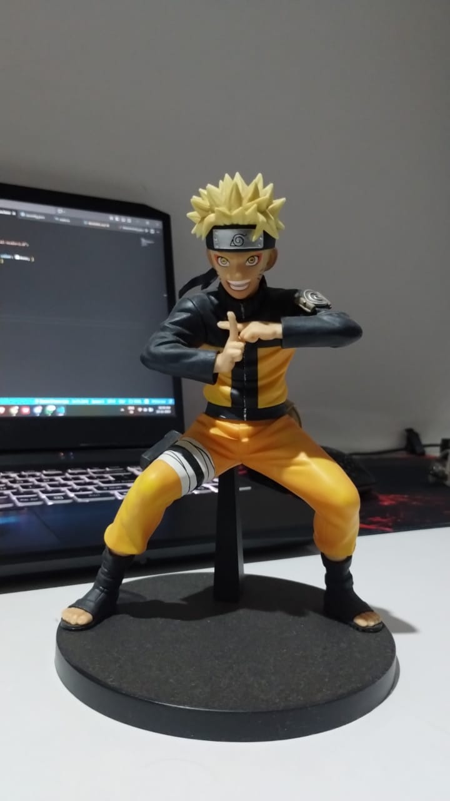
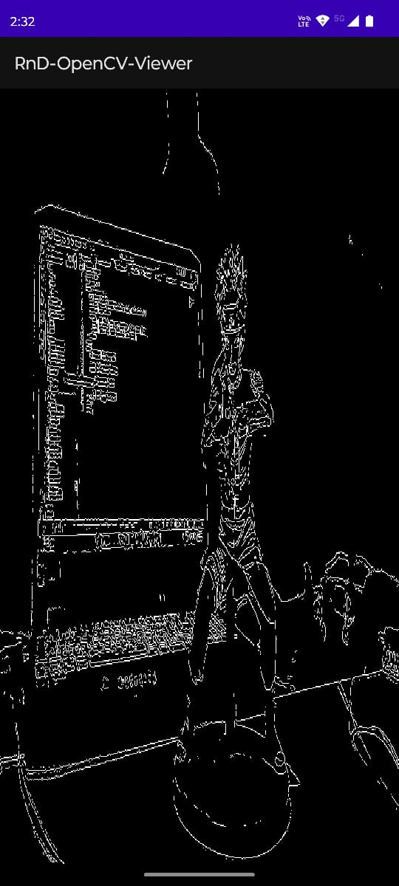
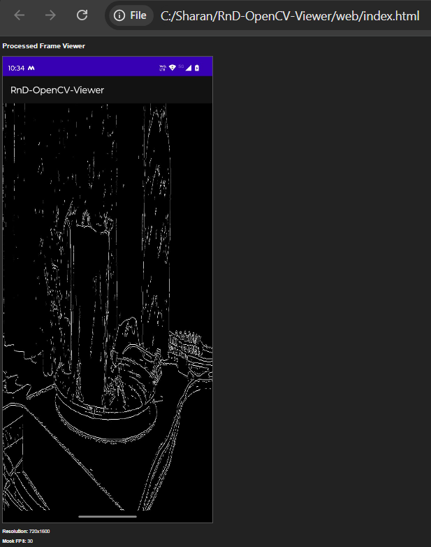

# RnD-OpenCV-Viewer

This project is a real-time edge detection viewer for Android. It captures the camera feed, processes it in C++ using OpenCV (Canny edge detection), and renders the result back to the screen using OpenGL ES 2.0. It also includes a minimal TypeScript web viewer to display a sample processed frame.

---

## Features Implemented

### Android App
* Live camera feed integration (using `Camera1` API).
* JNI bridge to pass camera frames (as `byte[]`) from Java to C++.
* Native C++ processing using OpenCV.
* Applied Canny Edge Detection (`cv::Canny`) on the grayscale (Y) plane of the camera frame.
* Real-time rendering of the processed frame using OpenGL ES 2.0 (as a texture).

### Web Viewer
* Minimal web page built with TypeScript and HTML.
* Displays a static sample processed frame (`images\sameple_image.jpeg`) on an HTML canvas.
* Shows a basic text overlay for frame stats (Resolution, Mock FPS) using DOM updates.
* TypeScript code is compiled to `main.js` using `tsc`.

---

## Architecture & Frame Flow

This project uses a hybrid architecture to pass data from the Java/Android layer to the native C++ layer for processing and rendering.

1.  **Camera (Java):** `MainActivity.java` uses the `Camera1` API. A `PreviewCallback` is set up to receive a `byte[]` array for each frame.
2.  **JNI Bridge (Java -> C++):** For every frame, `onPreviewFrame` calls the native `processFrame(int width, int height, byte[] frameData)` function.
3.  **OpenCV Processing (C++):** In `native-lib.cpp`, `processFrame` does the following:
    * Wraps the `byte[]` data in an OpenCV `cv::Mat` (as `matYUV`).
    * Extracts the grayscale (Y) plane (`matGray`).
    * Runs `cv::Canny` on `matGray` and stores the result in a global `cv::Mat processedMat`.
4.  **OpenGL Renderer (C++):**
    * The `GLSurfaceView` in Java calls `nativeOnDrawFrame()` continuously.
    * `nativeOnDrawFrame` checks if `processedMat` is ready.
    * It uploads the `processedMat` data to a GPU texture (`glTexImage2D`).
    * It then draws this texture onto a full-screen quad.

---

## Results

**Original Image:** 

**Working Android App:** 

**TypeScript Web Viewer:** 

---
